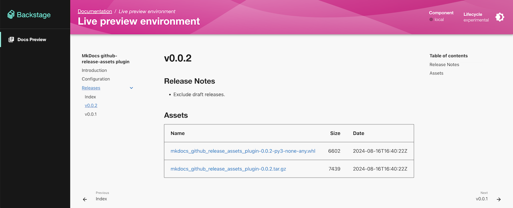

# MkDocs github-release-assets plugin

## Introduction

MkDocs plugin to include GitHub releases and assets in the documentation.

This allows you to make private software releases available to non-dev people who don't have access to the dev repository.

It is designed to be used with [Backstage TechDocs](https://backstage.io/docs/features/techdocs/) to create distribution sites within internal developer portals

The following screenshot is generated from [v0.0.2 release and assets](https://github.com/yaegashi/mkdocs-github-release-assets-plugin/releases/tag/v0.0.2).

